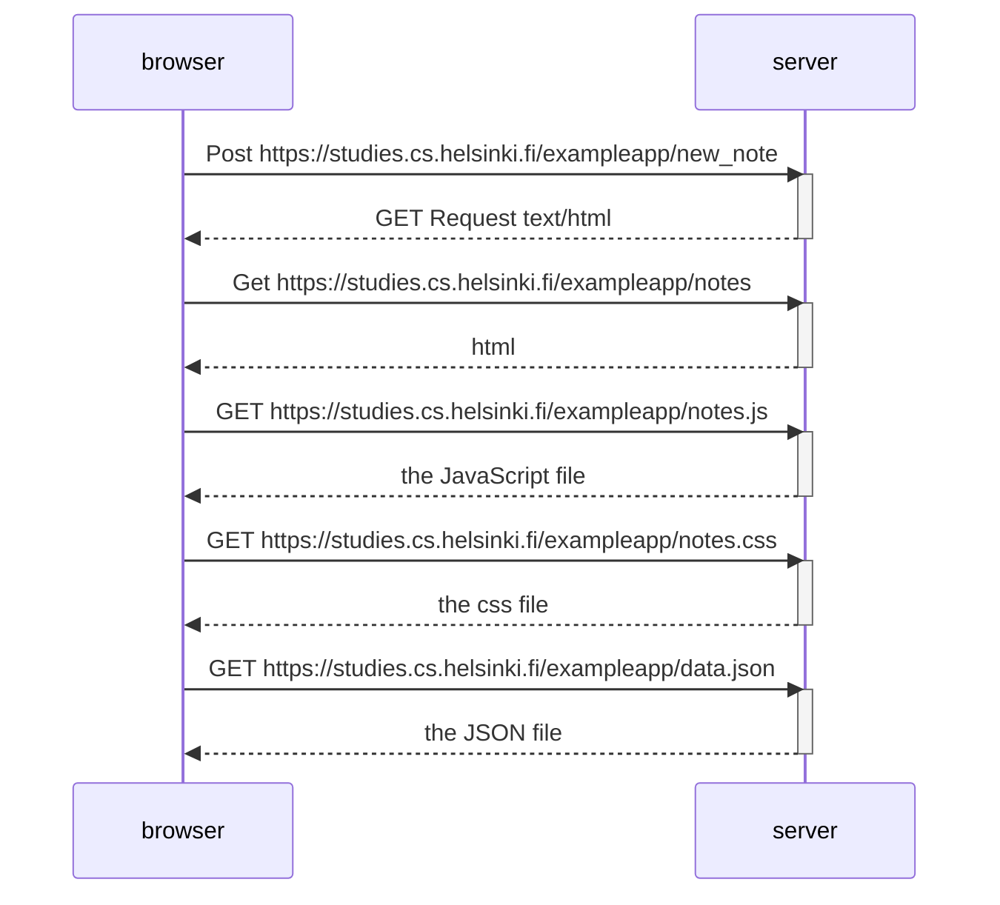

```mermaid
sequenceDiagram
    participant browser
    participant server
    
    browser->>server: Post https://studies.cs.helsinki.fi/exampleapp/new_note
    activate server
    server-->>browser: GET Request text/html
    deactivate server
    
    browser->>server: Get https://studies.cs.helsinki.fi/exampleapp/notes
    activate server
    server-->>browser: html
    deactivate server
    
    browser->>server: GET https://studies.cs.helsinki.fi/exampleapp/notes.js
    activate server
    server-->>browser: the JavaScript file
    deactivate server
    
    browser->>server: GET https://studies.cs.helsinki.fi/exampleapp/notes.css
    activate server
    server-->>browser: the css file
    deactivate server

    browser->>server: GET https://studies.cs.helsinki.fi/exampleapp/data.json
    activate server
    server-->>browser: the JSON file
    deactivate server

    
```